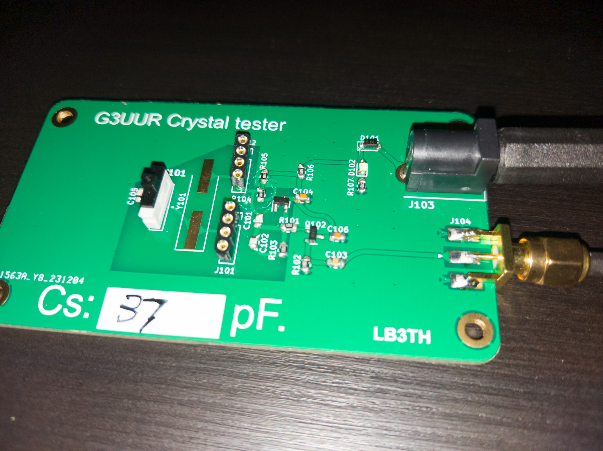
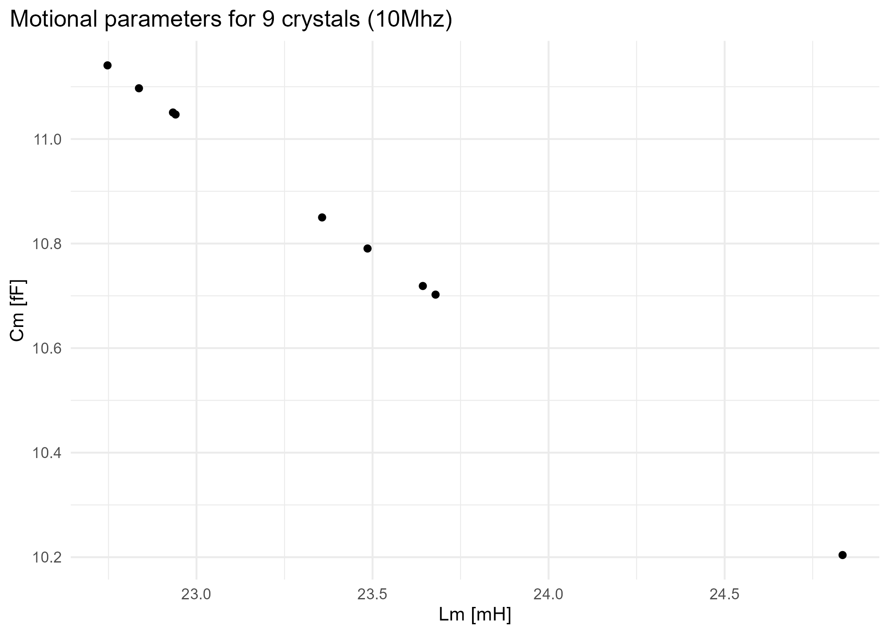

# Crystal tester
Creating pcbs for crystal tester (for measuring motional parameters for crystal filters).

- 2023-12-17: First G3UUR board populated.
- 2023-12-17: First crystals tested.

## The tester

## First tests

